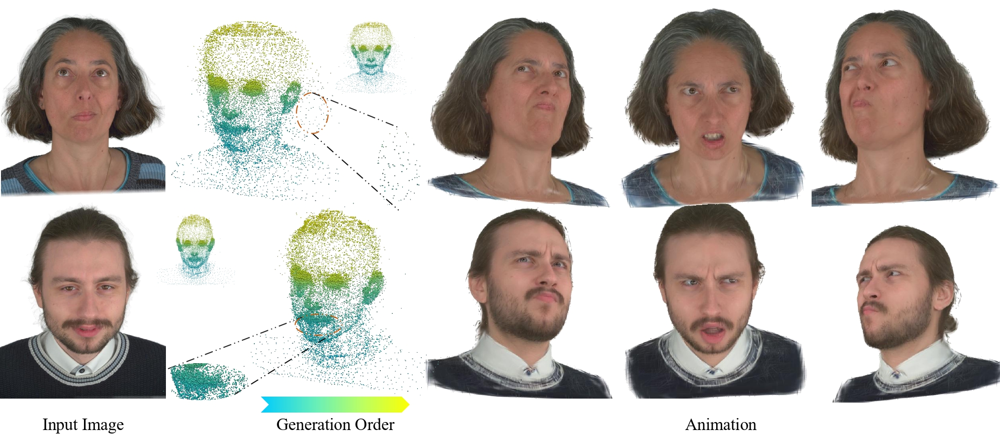
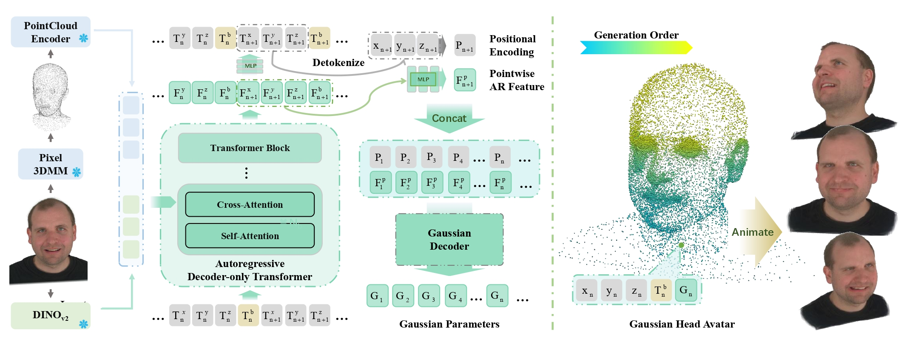

# AvatarPointillist: AutoRegressive 4D Gaussian Avatarization

[](https://kumapowerliu.github.io/AvatarPointillist/)
[](https://kumapowerliu.github.io/publications/)
[](#citation)
[](#status)

<p align="center">
  
</p>

> **AvatarPointillist** is an autoregressive framework for generating dynamic 4D Gaussian avatars from a single portrait image.

## Overview

AvatarPointillist formulates avatar generation as a sequential prediction problem. Starting from a single portrait image, the method:

- autoregressively generates Gaussian point clouds with a decoder-only Transformer
- jointly predicts per-point binding for animation
- decodes full renderable Gaussian attributes with a dedicated Gaussian decoder
- produces photorealistic and controllable 4D avatars

This repository will host the official implementation once the public release package is ready.

## Status

This repository is currently a **project placeholder** for the upcoming code release.

At the moment, we are **not yet releasing**:

- training code
- inference code
- data preprocessing code
- pretrained checkpoints

We will update this repository when the release materials are cleaned up and ready for public use.

## Project Resources

The full project page already contains the current visual materials:

- teaser video
- qualitative comparison clips
- gallery videos
- method overview figure
- abstract and citation

Project page: [https://kumapowerliu.github.io/AvatarPointillist/](https://kumapowerliu.github.io/AvatarPointillist/)

The original source materials are maintained under:

```text
/Users/liuhongyu/Desktop/个人资料/KumapowerLIU.github.io/AvatarPointillist
```

Useful assets there include:

```text
teaser/teaser2.mp4
teaser/teaser_page-0001.jpg
figures/pipeline_page-0001.jpg
gallery/*.mp4
videos/comparison_clips/*.mp4
videos/comparison_posters/*.jpg
```

## Method at a Glance

<p align="center">
  
</p>

AvatarPointillist contains two tightly coupled stages:

1. An autoregressive generator predicts Gaussian geometry tokens together with binding information.
2. A Gaussian decoder converts the generated representation into complete renderable Gaussian attributes for animation and rendering.

Conditioning the decoder on latent features from the autoregressive generator substantially improves the final avatar fidelity.

## Authors

- [Hongyu Liu](https://kumapowerliu.github.io/) <sup>1,2</sup>
- [Xuan Wang](https://xuanwangvc.github.io/) <sup>2</sup>
- [Yating Wang](https://scholar.google.com/citations?user=w1tn5rUAAAAJ&hl=zh-CN) <sup>2</sup>
- [Zijian Wu](https://zijian-wu.github.io/) <sup>2</sup>
- [Ziyu Wan](http://raywzy.com/) <sup>3</sup>
- [Yue Ma](https://mayuelala.github.io/) <sup>1</sup>
- [Runtao Liu](https://liuruntao.github.io/) <sup>1</sup>
- [Boyao Zhou](https://yaourtb.github.io/) <sup>2</sup>
- [Yujun Shen](https://shenyujun.github.io/) <sup>2</sup>
- [Qifeng Chen](https://cqf.io/) <sup>1</sup>

<sup>1</sup> HKUST  
<sup>2</sup> Ant Group  
<sup>3</sup> City University of Hong Kong

## Planned Release

We plan to organize the public release around the following components:

- environment setup
- checkpoints and pretrained models
- demo and inference scripts
- training pipeline
- data preparation instructions

## Citation

If you find this project useful, please cite:

```bibtex
@inproceedings{liu2026avatarpointillist,
  title     = {AvatarPointillist: AutoRegressive 4D Gaussian Avatarization},
  author    = {Hongyu Liu and Xuan Wang and Yating Wang and Zijian Wu and Ziyu Wan and Yue Ma and Runtao Liu and Boyao Zhou and Yujun Shen and Qifeng Chen},
  booktitle = {Proceedings of the IEEE/CVF Conference on Computer Vision and Pattern Recognition},
  year      = {2026}
}
```

## Contact

For project-related questions, please use the author homepages above or refer to the project page:

[https://kumapowerliu.github.io/AvatarPointillist/](https://kumapowerliu.github.io/AvatarPointillist/)
